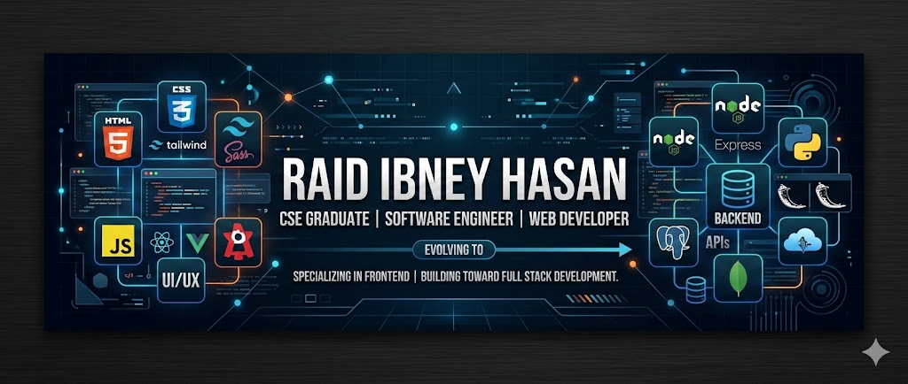

# Hi there, I'm Raid Ibney Hasan Arnob! 👋

  

  

---

# 💫 About Me

  

### 🚀 Aspiring Full-Stack Engineer | Frontend Specialist
I am a **Computer Science & Engineering** undergraduate at **AIUB**, majoring in **Software Engineering**. I thrive at the intersection of logic and design, currently mastering the art of building scalable, user-centric web applications.

- 🎓 **Education**: B.Sc in CSE at American International University-Bangladesh (AIUB)
- 💻 **Current Focus**: Transitioning from Frontend to Full-Stack Mastery
- ⚡ **Fun Fact**: I love blending utility-first CSS with elegant UI components to create seamless digital experiences.

---

### 🛠️ Tech Stack & Tools

  
  
  
  
  

#### 🌐 Web Development Specialties
- **Frontend**: `HTML5` | `CSS3` | `Tailwind CSS` | `DaisyUI` | `React` | `React Router`
- **Backend & DB**: `NestJS` | `MongoDB` | `MySQL`
- **Architectures**: MVC | RESTful APIs | Digital Workflow Platforms

---

### 📊 Performance & Growth

  
  

  

---

### 🔥 Contribution Graph

---

### 🤝 Let's Connect

 

  <i>"Code is like humor. When you have to explain it, it’s bad."</i> 
  <b>Keep Building. 🚀</b>

